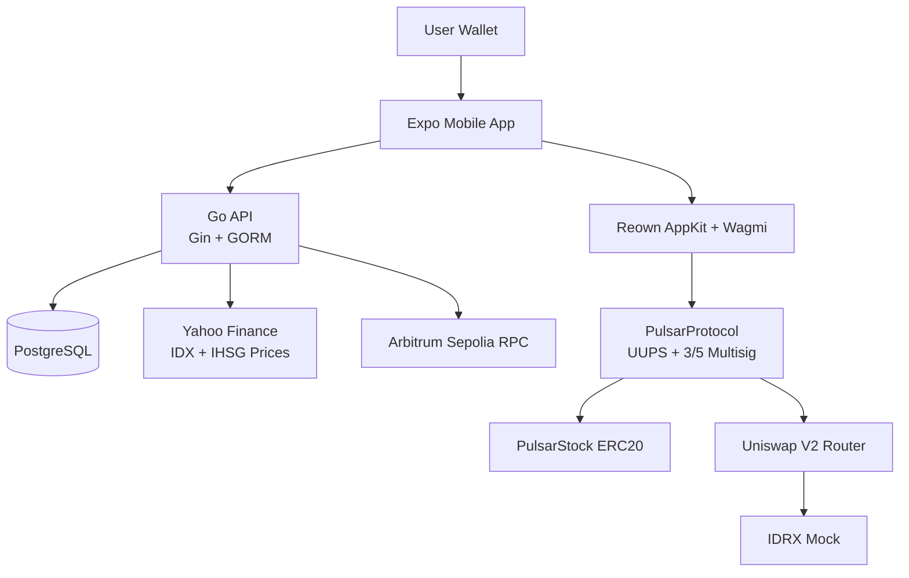

<div align="center">

# 

### Asset-backed Indonesian equity tokenization on Arbitrum Sepolia - Mobile App

[](https://reactnative.dev/)
[](https://expo.dev/)
[](#)
[](#)

**PulsarFi turns selected IDX equities into 1:1 pStock receipts with custodian attestations, IDRX settlement, and on-chain liquidity.**

[Explore Docs](https://pulsarfi-docs.vercel.app)

<br/>


</div>

---

## Why Mobile?

Even though the website is designed to be mobile-first, performance often feels lighter on a native mobile app, significantly reducing friction from a UX perspective.

## Overview

**A Note on Development:** This project was built with strict architectural oversight. While AI tools were leveraged to accelerate development, every line of code was explicitly directed, reviewed, and deeply understood. There is no 'vibecoding' here. AI acts solely as a velocity multiplier for a deliberately engineered system.

PulsarFi tokenizes Indonesian public equities into pStock tokens on Arbitrum Sepolia. Each pStock represents custodian-backed IDX exposure, priced through IDX market data and traded against IDRX liquidity.

The mobile app brings this experience directly to your phone:

- **Markets**: browse pStocks, IDX prices, IHSG, and token detail pages.
- **Portfolio**: view wallet holdings, transfers, swaps, and redemption requests.
- **Protocol Integration**: mint, approve, execute, and redeem pStocks through smart contracts via Reown AppKit.

## Architecture



## Stack

| Layer | Technology |
|---|---|
| Frontend | React Native, Expo, Nativewind (TailwindCSS), Reown AppKit, Wagmi |
| Backend | Go, Gin, GORM, PostgreSQL (External) |
| Smart contracts | Solidity, UUPS, OpenZeppelin, Uniswap V2 (External) |
| Data | Yahoo Finance chart API, on-chain AMM reserves |
| Network | Arbitrum Sepolia |

## Quick Start

```bash
# Install dependencies
npm install --legacy-peer-deps

# Run the project (with tunnel for WalletConnect reliability)
npx expo start --tunnel --clear
```

> **Note:** To test WalletConnect interactions and web3 libraries properly, the app must be run on a physical device using `expo-dev-client` or via a direct APK build. The standard Expo Go app does not support all the native modules required for the Web3 wallet integrations.

## Docs

Full documentation lives at [pulsarfi-docs.vercel.app](https://pulsarfi-docs.vercel.app).
